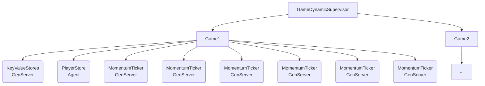

# Electrofrenetic

Electrofrenetic is an exploration of how to create multi-player games in Elixir.

You can read about how the game works in the [Game Description](https://github.com/cheerfulstoic/electrofrenetic/wiki/Game-Description) page

Electrofrenetic is a LiveView-based game using [PIXI.js](https://pixijs.com) for front-end rendering.  The choice to use LiveView was for convenience and my interest in creating this game was more about exploring how a game back-end for any front-end might work in Elixir.

The processes in the supervision tree for each game are responsible for maintaining a set of ETS tables which keep the state of the game.  These tables hold one attribute per table, approximately following the [ECS pattern](https://en.wikipedia.org/wiki/Entity_component_system).  I evaluated using [ECSx](https://github.com/ecsx-framework/ECSx) and [ECSpanse](https://github.com/iacobson/ecspanse), but I decided to implement my own system for a few reasons:

 * Both of the libraries felt quite heavy in terms of the required setup and wiring (ECSx moreso)
 * Implementing things myself allowed me to understand things better
 * As this was a prototype I wanted to be able to demonstrate the fundamental principles

To implement the "system" part of the entity-component-system pattern, I created multiple "Ticker" modules which update table state on their own intervals (e.g. the MomentumTicker updates positions based on velocities every 50ms and the DetectionTicker updates what entities can be detected by players every 2.5sec).

The set of processes which are used look like so:

Separately, the LiveView processes queries the state to regularly update the players' view.  The LiveView layer exists as a demonstration and could be replaced by a separate framework (e.g. Unity, pure Javascript, etc...) and communicate with Phoenix purely through websockets.

TODO: Try using Phoenix.Presence

## Usage

To start your Phoenix server:

* Run `mix setup` to install and setup dependencies
* Start Phoenix endpoint with `mix phx.server` or inside IEx with `iex -S mix phx.server`

Now you can visit [`localhost:4000`](http://localhost:4000) from your browser.

Ready to run in production? Please [check our deployment guides](https://hexdocs.pm/phoenix/deployment.html).

## Learn more

* Official website: <https://www.phoenixframework.org/>
* Guides: <https://hexdocs.pm/phoenix/overview.html>
* Docs: <https://hexdocs.pm/phoenix>
* Forum: <https://elixirforum.com/c/phoenix-forum>
* Source: <https://github.com/phoenixframework/phoenix>
