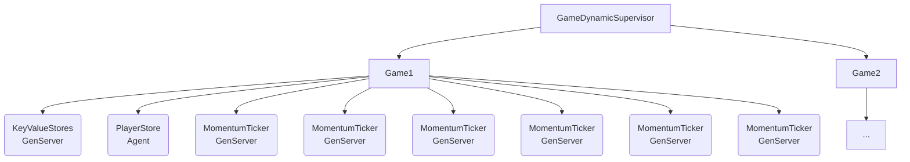

# Electrofrenetic

Electrofrenetic is an exploration of how to create multi-player games in Elixir.

You can read about how the game works in the [Game Description](https://github.com/cheerfulstoic/electrofrenetic/wiki/Game-Description) page

Electrofrenetic is a LiveView-based game using [PIXI.js](https://pixijs.com) for front-end rendering.  The processes in the supervision tree for each game are responsible for maintaining a set of ETS tables which keep the state of the game.  The LiveView processes then query the state to regularly update the players' view.

TODO: Try using Phoenix.Presence

## Usage

To start your Phoenix server:

* Run `mix setup` to install and setup dependencies
* Start Phoenix endpoint with `mix phx.server` or inside IEx with `iex -S mix phx.server`

Now you can visit [`localhost:4000`](http://localhost:4000) from your browser.

Ready to run in production? Please [check our deployment guides](https://hexdocs.pm/phoenix/deployment.html).

## Learn more

* Official website: <https://www.phoenixframework.org/>
* Guides: <https://hexdocs.pm/phoenix/overview.html>
* Docs: <https://hexdocs.pm/phoenix>
* Forum: <https://elixirforum.com/c/phoenix-forum>
* Source: <https://github.com/phoenixframework/phoenix>
